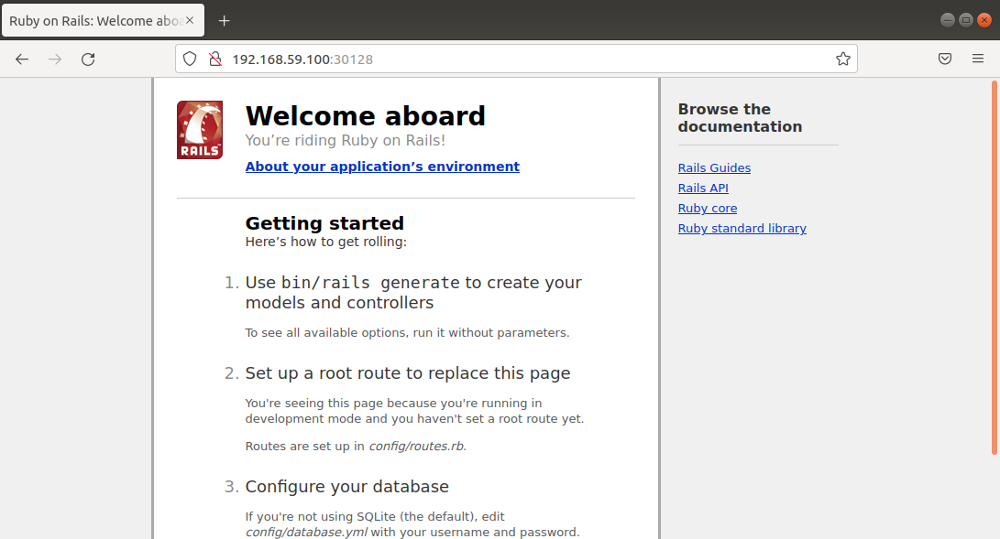

**Rails application running with Kubernetes Using the Minikube**
     
**Goals**:
   1- Create an image for a Rails application
   2- create a ConfigMap to define environment variables 
   3- Create a Database, Cache and Rails services

_Prerequisites_
 install docker, Minikube and kubectl
 
 _start cluster_
  `minikube start` 

_Building our Rails Images_
  
  This is updated and fixed working version of this repo [https://github.com/MahaGamal/KubernetesRailsApp]. appreciation of original workand author. 
  
  Using the rails application that can be found here [https://semaphoreci.com/community/tutorials/dockerizing-a-ruby-on-rails-application]. follow along. 

 after follow, let’s build the image.
 

 Creating the postgres service
   `kubectl create -f .`

